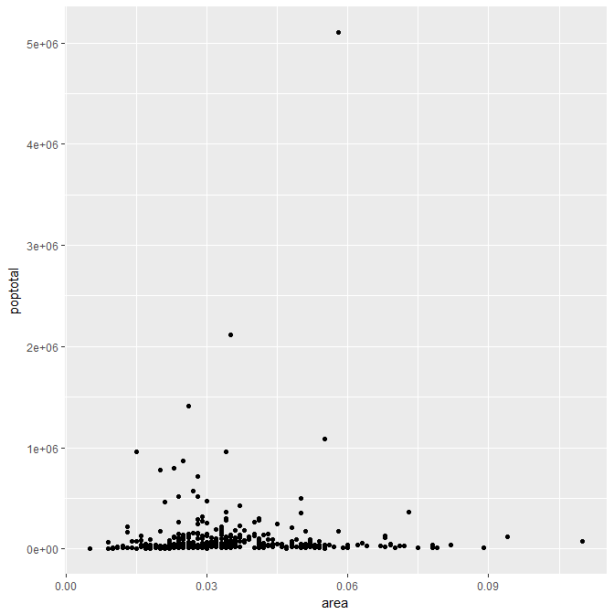
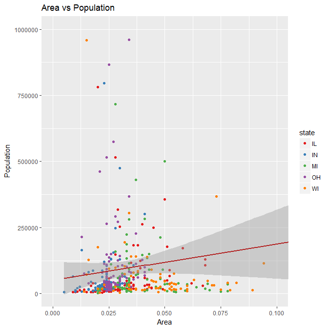
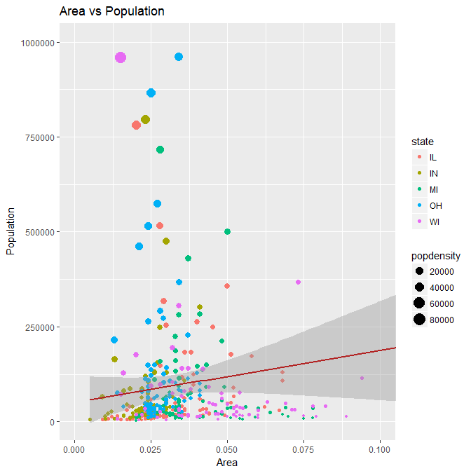
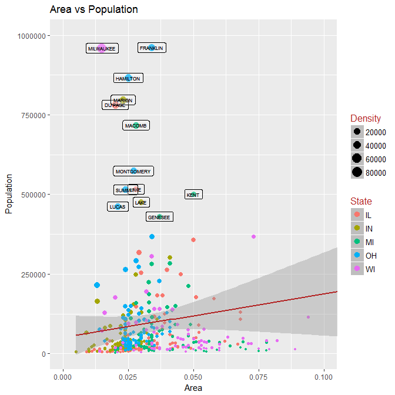
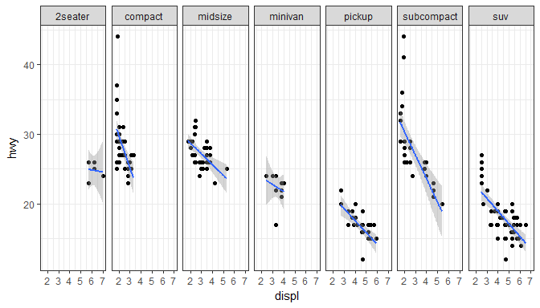
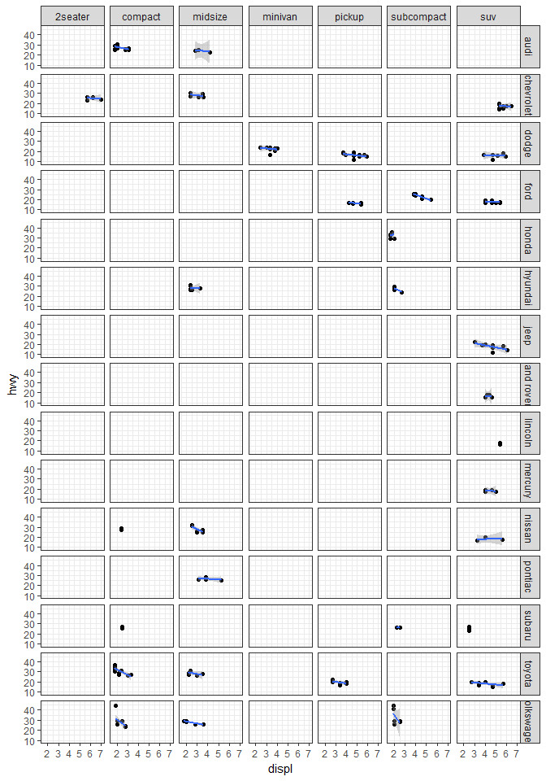
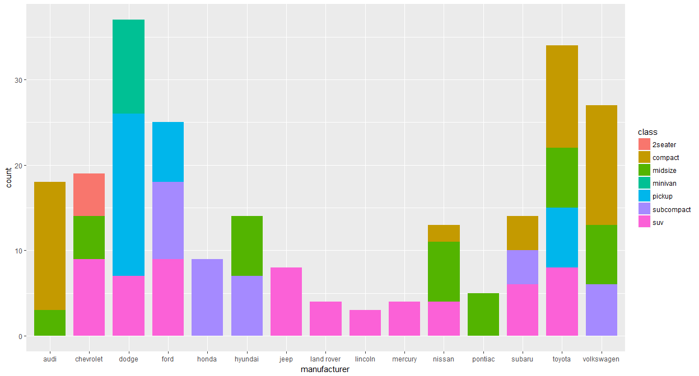
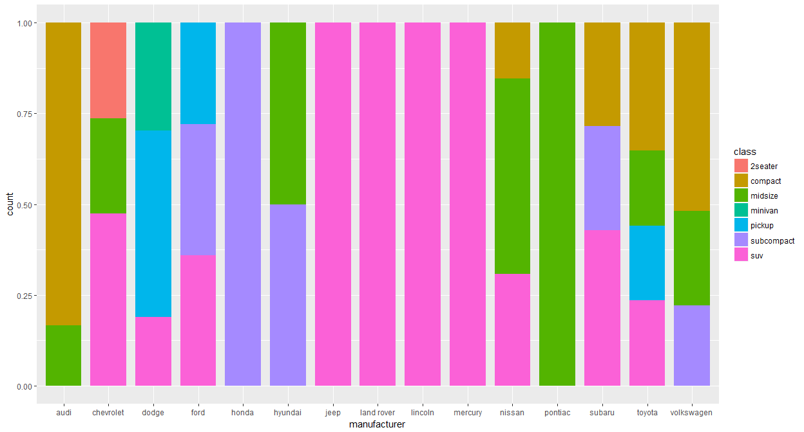
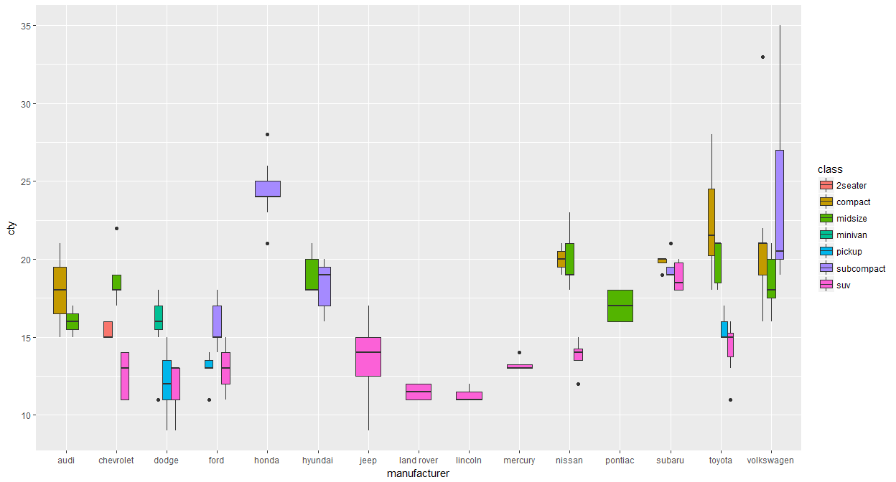

# GGPLOT
Jose Parreno Garcia  
February 2018  
<style>
body {
text-align: justify}

</style>

<br>


```r
library(knitr)
```

<br>

# GGplot2 basics

## Making simple scatter plot


```r
require(ggplot2)
data("midwest", package = "ggplot2")

g = ggplot(midwest, aes(x = area, y = poptotal))
g = g + geom_point()
g
```

<!-- -->

### Adding line of best fit


```r
g = ggplot(midwest, aes(x = area, y = poptotal))
g = g + geom_point()
g = g + geom_smooth(method = "lm")
g
```

<!-- -->

## Axis

### Changing axis limits

2 ways of changing axis limits:

* Bad one -> deleting points to match the window we want to focus on. It is bad practice because if we were to fit the line of best fit, this would change given that we have now a different set of points
* Good one -> zoom in and only focus on the are you want to focus.


```r
# Correct way of doing it
g = ggplot(midwest, aes(x = area, y = poptotal))
g = g + geom_point()
g = g + geom_smooth(method = "lm")
g = g + coord_cartesian(xlim = c(0,0.1), ylim = c(0, 1000000))
g
```

<!-- -->

### Titles and labels


```r
# Correct way of doing it
g = ggplot(midwest, aes(x = area, y = poptotal))
g = g + geom_point()
g = g + geom_smooth(method = "lm")
g = g + coord_cartesian(xlim = c(0,0.1), ylim = c(0, 1000000))
g = g + labs(title = "Area vs Population"
             , y = "Population"
             , x = "Area")
g 
```

<!-- -->

### Changing axis text


```r
# ADDING AT SPECIFIC BREAKS
g = ggplot(midwest, aes(x = area, y = poptotal))
g = g + geom_point(col = "steelblue")
g = g + geom_smooth(method = "lm", col = "firebrick")
g = g + coord_cartesian(xlim = c(0,0.1), ylim = c(0, 1000000))
g = g + labs(title = "Area vs Population"
             , y = "Population"
             , x = "Area")
g = g + scale_x_continuous(breaks = seq(0, 0.1, 0.01))
g
```

<!-- -->


```r
# CHANGING THE LABELS OF THE TICKS - adding letters as example
g = ggplot(midwest, aes(x = area, y = poptotal))
g = g + geom_point(col = "steelblue")
g = g + geom_smooth(method = "lm", col = "firebrick")
g = g + coord_cartesian(xlim = c(0,0.1), ylim = c(0, 1000000))
g = g + labs(title = "Area vs Population"
             , y = "Population"
             , x = "Area")
g = g + scale_x_continuous(breaks = seq(0, 0.1, 0.01), labels = letters[1:11])
g
```

<!-- -->


```r
# CHANGING THE LABELS OF THE TICKS - adding percentages
g = ggplot(midwest, aes(x = area, y = poptotal))
g = g + geom_point(col = "steelblue")
g = g + geom_smooth(method = "lm", col = "firebrick")
g = g + coord_cartesian(xlim = c(0,0.1), ylim = c(0, 1000000))
g = g + labs(title = "Area vs Population"
             , y = "Population"
             , x = "Area")
g = g + scale_x_continuous(breaks = seq(0, 0.1, 0.01), labels = sprintf('%1.2f%%', seq(0, 0.1, 0.01)))
g = g + scale_y_continuous(breaks = seq(0, 1000000, 200000))
g
```

<!-- -->

### Changing fonts


```r
# CHANGING THE LABELS OF THE TICKS - adding percentages
g = ggplot(midwest, aes(x = area, y = poptotal))
g = g + geom_point(col = "steelblue")
g = g + geom_smooth(method = "lm", col = "firebrick")
g = g + coord_cartesian(xlim = c(0,0.1), ylim = c(0, 1000000))
g = g + labs(title = "Area vs Population"
             , y = "Population"
             , x = "Area")
g = g + scale_x_continuous(breaks = seq(0, 0.1, 0.01), labels = sprintf('%1.2f%%', seq(0, 0.1, 0.01)))
g = g + scale_y_continuous(breaks = seq(0, 1000000, 200000))
g = g + theme(plot.title = element_text(size = 12, face = "bold", color = "steelblue", lineheight = 1.2)
              , axis.title.x = element_text(size = 10)
              , axis.title.y = element_text(size = 10)
              , axis.text.x = element_text(size = 10, angle = 30)
              , axis.text.y = element_text(size = 10))
g
```

<!-- -->


## Changing colours

### Assigning one colour


```r
# Correct way of doing it
g = ggplot(midwest, aes(x = area, y = poptotal))
g = g + geom_point(col = "steelblue")
g = g + geom_smooth(method = "lm", col = "firebrick")
g = g + coord_cartesian(xlim = c(0,0.1), ylim = c(0, 1000000))
g = g + labs(title = "Area vs Population"
             , y = "Population"
             , x = "Area")
g 
```

<!-- -->

### Assigning colour based on another column


```r
g = ggplot(midwest, aes(x = area, y = poptotal))
g = g + geom_point(aes(col = state))
g = g + geom_smooth(method = "lm", col = "firebrick")
g = g + coord_cartesian(xlim = c(0,0.1), ylim = c(0, 1000000))
g = g + labs(title = "Area vs Population"
             , y = "Population"
             , x = "Area")
g 
```

<!-- -->

### Changing colour palette


```r
library(RColorBrewer)

g = ggplot(midwest, aes(x = area, y = poptotal))
g = g + geom_point(aes(col = state))
g = g + geom_smooth(method = "lm", col = "firebrick")
g = g + coord_cartesian(xlim = c(0,0.1), ylim = c(0, 1000000))
g = g + labs(title = "Area vs Population"
             , y = "Population"
             , x = "Area")
g = g + scale_color_brewer(palette = "Set1")
g
```

<!-- -->

### Different sizes of points depending on another column


```r
g = ggplot(midwest, aes(x = area, y = poptotal))
g = g + geom_point(aes(col = state, size = popdensity))
g = g + geom_smooth(method = "lm", col = "firebrick")
g = g + coord_cartesian(xlim = c(0,0.1), ylim = c(0, 1000000))
g = g + labs(title = "Area vs Population"
             , y = "Population"
             , x = "Area")
g
```

<!-- -->

<br>

# Manipulate legend, adding text to plot and annotations

## Changing legend components


```r
# CHANGING LEGEND TITLE

g = ggplot(midwest, aes(x = area, y = poptotal))
g = g + geom_point(aes(col = state, size = popdensity))
g = g + geom_smooth(method = "lm", col = "firebrick")
g = g + coord_cartesian(xlim = c(0,0.1), ylim = c(0, 1000000))
g = g + labs(title = "Area vs Population"
             , y = "Population"
             , x = "Area")
g = g + scale_color_discrete(name = "State") + scale_size_continuous(name = "Density")
g
```

<!-- -->


```r
# CHANGING LEGEND POSITION

g = ggplot(midwest, aes(x = area, y = poptotal))
g = g + geom_point(aes(col = state, size = popdensity))
g = g + geom_smooth(method = "lm", col = "firebrick")
g = g + coord_cartesian(xlim = c(0,0.1), ylim = c(0, 1000000))
g = g + labs(title = "Area vs Population"
             , y = "Population"
             , x = "Area")
g = g + scale_color_discrete(name = "State") + scale_size_continuous(name = "Density")
g = g + theme(legend.position = "bottom")
g
```

<!-- -->


```r
# CHANGING LEGEND STYLE

g = ggplot(midwest, aes(x = area, y = poptotal))
g = g + geom_point(aes(col = state, size = popdensity))
g = g + geom_smooth(method = "lm", col = "firebrick")
g = g + coord_cartesian(xlim = c(0,0.1), ylim = c(0, 1000000))
g = g + labs(title = "Area vs Population"
             , y = "Population"
             , x = "Area")
g = g + scale_color_discrete(name = "State") + scale_size_continuous(name = "Density")
g = g + theme(legend.title = element_text(size = 12, color = "firebrick")
              , legend.text = element_text(size = 10)
              , legend.key = element_rect(fill = "gray"))
g = g + guides(colour = guide_legend(override.aes = list(size = 2, stroke = 1.5)))
g
```

<!-- -->

## Adding text to the plot


```r
# Text for only records where population is more than 400k
midwest_sub = midwest[midwest$poptotal > 400000, ]
midwest_sub$large_county = ifelse(midwest_sub$poptotal > 400000, midwest_sub$county, "")

g = ggplot(midwest, aes(x = area, y = poptotal))
g = g + geom_point(aes(col = state, size = popdensity))
g = g + geom_smooth(method = "lm", col = "firebrick")
g = g + coord_cartesian(xlim = c(0,0.1), ylim = c(0, 1000000))
g = g + labs(title = "Area vs Population"
             , y = "Population"
             , x = "Area")
g = g + scale_color_discrete(name = "State") + scale_size_continuous(name = "Density")
g = g + theme(legend.title = element_text(size = 12, color = "firebrick")
              , legend.text = element_text(size = 10)
              , legend.key = element_rect(fill = "gray"))
g = g + guides(colour = guide_legend(override.aes = list(size = 2, stroke = 1.5)))
g = g + geom_text(aes(label = large_county), size = 2, data = midwest_sub)
g = g + geom_label(aes(label = large_county), size = 2, data = midwest_sub, alpha = 0.25)
g
```

<!-- -->

## Add annotation to the chart


```r
library(grid)

my_text = "This text is at x = 0.7 and y = 0.9"
my_grob = grid.text(my_text, x = 0.7, y = 0.9, gp = gpar(col = "firebrick"
                                                         , fontsize = 10
                                                         , fontface = "bold"))
```

<!-- -->

```r
# Text for only records where population is more than 400k
midwest_sub = midwest[midwest$poptotal > 400000, ]
midwest_sub$large_county = ifelse(midwest_sub$poptotal > 400000, midwest_sub$county, "")

g = ggplot(midwest, aes(x = area, y = poptotal))
g = g + geom_point(aes(col = state, size = popdensity))
g = g + geom_smooth(method = "lm", col = "firebrick")
g = g + coord_cartesian(xlim = c(0,0.1), ylim = c(0, 1000000))
g = g + labs(title = "Area vs Population"
             , y = "Population"
             , x = "Area")
g = g + scale_color_discrete(name = "State") + scale_size_continuous(name = "Density")
g = g + theme(legend.title = element_text(size = 12, color = "firebrick")
              , legend.text = element_text(size = 10)
              , legend.key = element_rect(fill = "gray"))
g = g + guides(colour = guide_legend(override.aes = list(size = 2, stroke = 1.5)))
g = g + geom_text(aes(label = large_county), size = 2, data = midwest_sub)
g = g + geom_label(aes(label = large_county), size = 2, data = midwest_sub, alpha = 0.25)
g = g + annotation_custom(my_grob)
g
```

<!-- -->

# Drawing multiple plots with faceting

## Faceting against x~y vars against an extra var


```r
# Load data
data(mpg, package = "ggplot2")

# Plot V1
g = ggplot(mpg, aes(x = displ, y = hwy))
g = g + geom_point()
g = g + geom_smooth(method = "lm")
g = g + theme_bw()
g = g + facet_wrap(~ class)
g
```

<!-- -->


```r
# Load data
data(mpg, package = "ggplot2")

# Plot V2
g = ggplot(mpg, aes(x = displ, y = hwy))
g = g + geom_point()
g = g + geom_smooth(method = "lm")
g = g + theme_bw()
g = g + facet_grid(~ class)
g
```

<!-- -->

## Faceting against x~y vars against 2 extra vars


```r
# Load data
data(mpg, package = "ggplot2")

g = ggplot(mpg, aes(x = displ, y = hwy))
g = g + geom_point()
g = g + geom_smooth(method = "lm")
g = g + theme_bw()
g = g + facet_grid(manufacturer ~ class)
g
```

<!-- -->

## Laying multiple charts in a single panel


```r
library(gridExtra)

g = ggplot(mpg, aes(x = displ, y = hwy))
g = g + geom_point()
g = g + geom_smooth(method = "lm")
g = g + theme_bw()
g = g + facet_grid(~ class)
g1 = g

g = ggplot(mpg, aes(x = displ, y = hwy))
g = g + geom_point()
g = g + geom_smooth(method = "lm")
g = g + theme_bw()
g = g + facet_grid(~ cyl)
g2 = g

gridExtra::grid.arrange(g1, g2, ncol = 2)
```

<!-- -->

# Bar charts

## Simplest bar chart - one variable


```r
# When only 1 variable is provided, histogram automatically computes the count
g = ggplot(mpg, aes(manufacturer))
g = g + geom_bar()
g
```

<!-- -->

## Bar chart filled depending on other variable


```r
g = ggplot(mpg, aes(manufacturer))
g = g + geom_bar(width = 0.8, aes(fill = class))
g
```

<!-- -->

## Bar chart showing 100% fill 


```r
g = ggplot(mpg, aes(manufacturer))
g = g + geom_bar(width = 0.8, aes(fill = class), position = "fill")
g
```

<!-- -->

## Bar chart of aggregated data


```r
# Aggregate data
cty_mpg = aggregate(mpg$cty, by = list(mpg$manufacturer), FUN = mean)
colnames(cty_mpg) = c("manufacturer", "mileage")

g = ggplot(cty_mpg, aes(x = manufacturer, y = mileage, fill = mileage))
g = g + geom_bar(stat = "identity")
g
```

<!-- -->


## Box plot


```r
# Aggregate data
cty_mpg = aggregate(mpg$cty, by = list(mpg$manufacturer), FUN = mean)
colnames(cty_mpg) = c("manufacturer", "mileage")

g = ggplot(mpg, aes(x = manufacturer, y = cty))
g = g + geom_boxplot()
g
```

<!-- -->


## Box plot by category


```r
# Aggregate data
cty_mpg = aggregate(mpg$cty, by = list(mpg$manufacturer), FUN = mean)
colnames(cty_mpg) = c("manufacturer", "mileage")

g = ggplot(mpg, aes(x = manufacturer, y = cty))
g = g + geom_boxplot(aes(fill = class), width = 0.5)
g
```

<!-- -->


